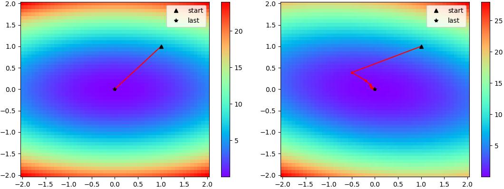
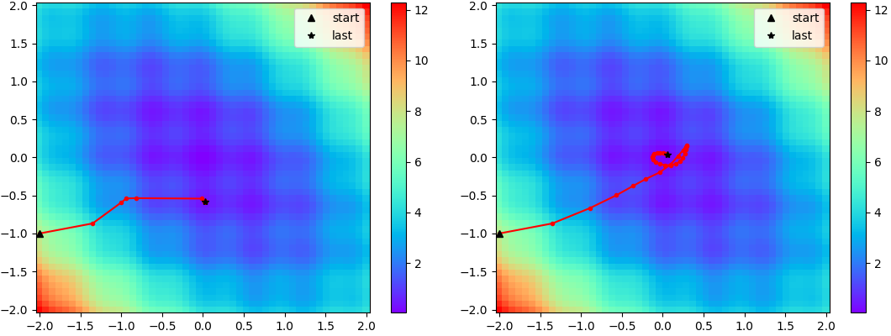

# Analyze AdaHessian

This repository allows analyzing the new AdaHessian optimizer and its parameters on 2D functions f(x, y).

## Usage

Go to `src/` and run the script `main.py`.
All parameters of this script have default values (so they are all optional):
* --func: the function to be optimized, the 2D input vector (x, y) must be named "v", PyTorch functions can be used, e.g. "v\[0\]\*\*2+v\[1\]\*\*2" for a quadratic function x^2+y^2.
* --start: start value v0=(x0, y0), e.g. "1 2" to start at (1, 2)
* --num_iter: number of iterations
* --lr: learning rate
* --beta_g: momentum-parameter for the gradient
* --beta_h: momentum-parameter for the Hessian
* --hessian_pow: Hessian power, between between 1 and 0, where 1 gives the Newton update direction (default), while 0 gives the gradient descent update direction
* --num_samples: the Hessian diagonal is computed using random vectors, where the approximation of the Hessian gets better when taking more samples per iteration (default 1)
* --window: the region shown in the plot, specified in the order left, right, bottom, top, with left < right and bottom < top, e.g. "-3 1 -2 5"

## Examples

### Quadratic functions

* `python main.py --func "v[0]**2+5*v[1]**2" --beta_g 0 --beta_h 0 --lr 1`: here AdaHessian behaves like the "vanilla" Newton method (lr=1, betas=0, 0) on a quadratic function without mixed terms (x\*y), for which a single step is enough to reach the minimum (left plot)
* `python main.py --func "v[0]**2+5*v[1]**2+v[0]*v[1]" --beta_g 0 --beta_h 0 --lr 0.5`: quadratic function with mixed terms (x\*y), for which AdaHessian with its diagonal-only Hessian is not able to jump directly to the minimum in contrast to "vanilla" Newton (right plot)

### Simulated noise

* `python main.py --func "v[0]**2+v[1]**2+v[0]*v[1]+0.5*torch.sum(torch.sin(5*v)**2)" --beta_g 0 --beta_h 0 --lr 1 --start -2 -1 --num_iter 30`: there are multiple local minima due to the simulated noise, and AdaHessian gets stuck in one of them (left plot)
* `python main.py --func "v[0]**2+v[1]**2+v[0]*v[1]+0.5*torch.sum(torch.sin(5*v)**2)" --beta_g 0.9 --beta_h 0.9 --lr 1 --start -2 -1 --num_iter 30`: by using momentum for both gradient and Hessian, the optimizer can "average out" the noise and find the global minimum (right plot)

## References

* [Paper](https://arxiv.org/pdf/2006.00719.pdf)
* Implementations for PyTorch
  * [Original implementation](https://github.com/amirgholami/adahessian) from the authors of the paper
  * [Re-implementation](https://github.com/davda54/ada-hessian) by davda54 with a nicer interface, which I use for this repository
